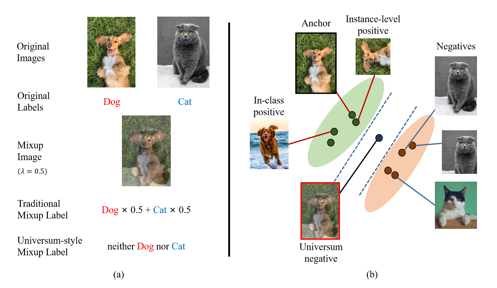
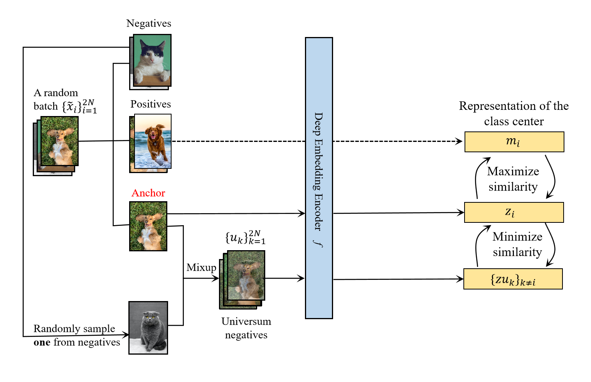

# UniCon: Universum-inspired Supervised Contrastive Learning (TIP2023)

The intuition of this paper is simple: why don't we assign Mixup samples to a generalized negative class? Just as humans
may perceive, if an animal is half dog and half cat, it is actually of neither species.
<p align="center">
  
</p>
With this intuition, our framework is like this:
<p align="center">
  
</p>


Here we present the implementation of UniCon(ours)[1], SupCon[2], SimClr[3], Xent and SupMix(a hybrid of SupCon and
Un-Mix[4] proposed by us) on Pytorch. We use CIFAR-100 as an example dataset.
[1]: Universum-inspired Supervised Contrastive Learning [paper](https://arxiv.org/abs/2204.10695)  
[2]: Supervised Contrastive Learning [paper](https://arxiv.org/abs/2004.11362)  
[3]: A Simple Framework for Contrastive Learning of Visual Representations [paper](https://arxiv.org/abs/2002.05709)  
[4]: Un-Mix: Rethinking Image Mixtures for Unsupervised Visual Representation
Learning [paper](https://arxiv.org/abs/2003.05438)


## Comparison

Results on CIFAR-100:
|Method|Architecture|Batch size|Accuracy(%)|
|---|---|---|---|
|Cross Entropy|ResNet-50|1024|74.6|
|SimCLR|ResNet-50|1024|68.4|
|SupCon(baseline)|ResNet-50|1024|76.5|
|UniCon(ours)|ResNet-18|256|79.2|
|UniCon(ours)|ResNet-50|256|81.7|


## Running

We refer you to the [official pytorch implementation of SupCon](https://github.com/HobbitLong/SupContrast) for 
the implementations of SupCon and SimCLR. If you want to run SupCon and SimCLR with our code, you can simply change 
`python main_supcon.py` to `python main_unicon.py` and maintain other parts. We will give instructions on SupCon, 
SupMix and CE classifier. Our samples are running on CIFAR-100 and you can run on CIFAR-10, TinyImageNet and ImageNet
(you need to download the datasets yourself for the latter two) with `--dataset cifar10/tinyimagenet/imagenet`.  

**(1) UniCon**

```
python main_unicon.py --batch_size 256
  --learning_rate 0.05 --temp 0.1
  --cosine --warm
```

You can change Mixup parameter with `--lamda 0.5`. Or you can use CutMix with `--mix cutmix`.    

**(2) SupMix**  
```
python main_supmix.py --batch_size 256
  --learning_rate 0.05 --temp 0.1
  --cosine --warm --beta --lamda 0.5
```
Here `--lamda` is used in distribution Beta(lambda, lambda). You can also set lambda to a constant by reducing
`--beta`.  

**(3) Cross Entropy**

```
python main_ce.py --batch_size 1024
  --learning_rate 0.8
  --cosine
```
You can use `--augment`, `--mixup --alpha 0.5`, `--cutmix --alpha 0.5 --cutmix_prob 0.5` to enable augmentations, 
Mixup and CutMix, respectively. Please note that Mixup and CutMix cannot be applied together. If so, only Mixup is 
used.  

**(4) Linear Evaluation**

```
python main_linear.py --batch_size 512
  --learning_rate 5
  --ckpt /path/to/model.pth
```

## Reference

```
@article{han2023universum,
  title={Universum-inspired supervised contrastive learning},
  author={Han, Aiyang and Geng, Chuanxing and Chen, Songcan},
  journal={IEEE Transactions on Image Processing},
  volume={32},
  pages={4275--4286},
  year={2023},
  publisher={IEEE}
}
```
